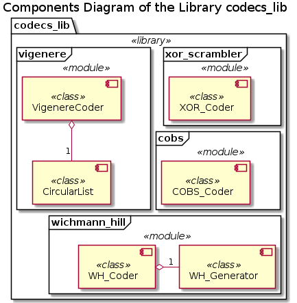

# UD000 User Reference Documentation on the Library codecs_lib

## Scope

This document provides reference documentation on the library **codecs_lib**, which is a *collection* of simple 'codecs' for the data manipulation: reversible repacking or scrambling.

The library includes 4 modules:

* *cobs* - see [UD001](./UD001_cobs_reference.md)
* *vigenere* - see [UD002](./UD002_vigenere_reference.md)
* *wichmann_hill* - see [UD003](./UD003_wichmann_hill_reference.md)
* *xor_scrambler* - see [UD004](./UD004_xor_scrambler_reference.md)

## Design and Functionality

Each of the modules implements a specific codec:

* **COBS_Coder** - per-byte packing and unpacking or a binary data for the communication protocols expecting '0x00' package delimiters using the Consistent Overhead Byte Shuffling (COBS) algorithm
* **VigenereCoder** - per-byte encription of the text data into a binary data format and reverse binary -> text decryption using the multuple substitution Vigenere cipher algorithm
* **WH_Coder** - (de-) scrambling of a sequence / stream of floating point numbers based on the Wichmann-Hill pseudo-random numbers generator
* **XOR_Coder** - encryption of the text data (as Unicode string(s) or byte-encoded representation) into a binary form and the reverse decryption using per-byte XORing algorithm

Each of the codec classes provides two methods: *encode*() and *decode*() for the encryption and decryption respectively. The **VigenereCoder** requires a *pass-phrase* for the encryption and decryption processed, which can be supplied as an Unicode string, or an arbitrary sequence of bytes (byte-string or bytes array). The internal RNG within the **WH_Coder** can be re-seeded at any time in order to synchronize the random numbers sequence in encryption and decryption, thus such triplet of the seed values serves as the encryption / decryption key.

## Implementation Details

Each of the modules in the library is independent from the others and, theoretically, can be used as a stand-alone module.

There are no other external dependencies except for the *introspection_lib* library, specifically *introspection_lib.base_exceptions* module, where the custom variants of the standard exception classes are implemented with the added traceback analysis functionality.

Apart from the 4 codec classes there are 2 'helper' classes defined, which can be used on their own:

* **CircularList** - implementation of an indefinite, repetitive looping through the content of a generic iterative sequence
* **WH_Generator** - implementation of a pseudo-random numbers generator using Wichmann-Hill alogorithm
