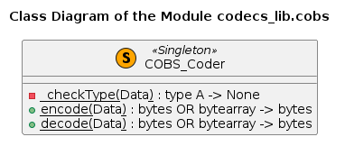

# UD001 User and API Reference Documentation on the Module codecs_lib.cobs

## Scope

This document provides reference documentation on the module **codecs_lib.cobs**, which implements the Consistent Overhead Byte Stuffing encoding / decoding algorithm [[1-3]](#references). Intended functionality of the module, design and implementation details as well as API reference are provided.

Covered functional components:

* Class **COBS_Coder**

## Design and Functionality

The communication over serial port with the devices is often implemented in the binary mode using '\x00' (zero) characters as the package delimiters. Thus an arbitrary bytes sequence containg zeroes must be encoded before sending and decoded after sending such that the sent sequence itself does not contain zeroes, at least, un-escaped. The *C*onsistent *O*verhead *B*yte *S*tuffing encoding / decoding algorithm (COBS) allows reversible zeroes eliminiation without use of the escape sequences.

The *encoding* algorithm is [[1]](#references):

* First append a zero byte to the tail, then break them into groups of either 254 non-zero bytes, or 0–253 non-zero bytes followed by a zero byte - thus the zero bytes serve as tail-delimiters of sub-sequences of non-zero bytes, which may be empty (zero length).
* Encode each group by deleting the trailing zero byte (if any) and prepending the number of non-zero bytes, plus one. Thus, each encoded group is the same size as the original, except that 254 non-zero bytes are encoded into 255 bytes by prepending a byte of 255.
* As a special exception, if a packet ends with a group of 254 non-zero bytes, it is not necessary to add the trailing zero byte.

Here are *examples* of the original and COBS encoded byte sequences with the boundaries between the groups indicated by the hyphen / minus sign.

| Original data (hex)   | Modified data (hex)      | Encoded data (hex)          |
| --------------------- | ------------------------ | --------------------------- |
| 00                    | 00-00                    | 01 01                       |
| 00 00                 | 00-00-00                 | 01 01 01                    |
| 11 22 00 33           | 11 22 00-33 00           | 03 11 22 02 33              |
| 11 22 33 44           | 11 22 33 44 00           | 05 11 22 33 44              |
| 11 00 00 00           | 11 00-00-00-00           | 02 11 01 01 01              |
| 01 02 03 ... FD FE    | 01 02 03 ... FD FE       | FF 01 02 03 ... FD FE       |
| 00 01 02 03 ... FD FE | 00-01 02 03 ... FD FE    | 01 FF 01 02 03 ... FD FE    |
| 01 02 03 ... FD FE FF | 01 02 03 ... FD FE-FF 00 | FF 01 02 03 ... FD FE 02 FF |
| 02 03 04 ... FE FF 00 | 02 03 04 ... FE FF-00-00 | FF 02 03 04 ... FE FF 01 01 |

The *decoding* algorithm can be easier explained assuming the sequential byte-by-byte reading from a stream (e.g. a file):

* Read 1 byte, let its value be **N** (in the 1 to 255 range)
  * if **N** is 1 then append zero (0) to the output sequence
  * otherwise (**N** > 1) read the next **N**-1 byte and append them to the output sequence
* Repeat step 1 until the end of the stream / file is reached of the packet delimiter '\x00' is encountered
* If the output sequence ends with zero (0, '\x00') - remove it

The majority of the commonly available implementations of this algorithm are based on the byte-by-byte conversion of the input, e.g. as in the Python library in the PyPI depository [[2]](#references) or in the NodeJS module *cobs* used by the NodeJS implementation, see figures below.

On the other hand, the communication over a serial port occurs via a pipe, thus the data (bytes sequence) is sent as a byte-string. The Python language has a special data (sub-) type - the byte-string, which are immutable sequences. Therefore they provide the standard indexing and slicing functionality, although only for the read-access. On the other hand, being strings, they also provide leading / tailing characters stripping and splitting into sub-strings functionality (the split-characters are removed!). The slicing and splitting allow more elegant implementation of the algorithm.

Thus the *functional requirements* for the module are:

* The module should implement the strict COBS encoding and decoding using Python programming language without concerns for the package delimiters
* The encoder should not add the package delimiters to the encoded data, when required the delimiter will be added by another piece of software
* The decoder should ignore the leading and trailing package delimiters
* Both the encoder and decoder should accept a byte-string or bytes array as the input and return a byte-string

The complete requirements list can be found in [RE001](../Requirements/RE001_cobs_requirements.md) document.

### References

1. [Wikipedia](https://en.wikipedia.org/wiki/Consistent_Overhead_Byte_Stuffing)
2. [PyPI](https://pypi.org/project/cobs/)
3. Cheshire, Stuart; Baker, Mary (April 1999). "Consistent Overhead Byte Stuffing". IEEE/ACM Transactions on Networking. 7 (2): 159–172. CiteSeerX 10.1.1.108.3143. doi:10.1109/90.769765. Retrieved November 30, 2015.

## Implementation Details

The module implements a single class **COBS_Coder**, which has only two methods - **encode()** and **decode()**, both of which are class methods. Thus the class can be used without instantiation as a *Singleton*, see figure below.

Unlike the Python library in the PyPI depository [[2]](#references) or in the NodeJS module *cobs* this implementation is based on the slice indexing and strings splitting.

The **encode()** method uses splitting in order to produce a sequence of non-zero bytes sequences (it is possible for a sub-sequence to be of the zero length), and slicing to split long non-zero sequence (> 254 characters). For each slice of the non-zero length its length + 1 is palced into the resulting string first, followed by the slice itself. Unless the length of the sub-string is 254 characters, or it is the last sub-string in the initial data string, the '\x01' (one) character is placed after it. The zero length sub-strings are represented by the '\x01' character, which happend in the case of zero ('\x00') being the first of the last character in the intial string, or two or more consecutive zeroes in the intial string. The produced sub-strings are copied as blocks, not in the byte-per-byte manner. See figure below for the details.

The **decode()** method, at first, strips all leading and tailing '\x00' characters (packet delimiters). Thus, even if the package delimiters are not removed as intended, they are simply ignored. It also uses slicing for the block-copying of the data. It reads a byte at the start of a sub-sequence, which defines the offset to the start of the next sub-sequence (say, 0 < **N** < 256). If the offset is > 1, the next **N**-1 characters are copied. Unless **N** == 255 or the sub-sequence is the last in the package, the zero character ('\x00') is added as well. The sub-sequences with **N** == 1 are simply ingnored. See figure below for the details.

The both methods use the concatenation of the already accumulated data (as a byte-string) with the newly produced sub-strings (refered to as *append* in the diagrams above).

## API

### Classes

#### Class COBS_Coder

Singleton-like class implementing Consistent Overhead Byte Stuffing (COBS) encoding / decoding algorithm disregarding the packet delimiting b'\x00' characters. All methods are class methods, thus the instantiation is not required, although it is possible.

***Class Methods***

**encode**(*Data*)

*Signature*:

bytes OR bytearray -> bytes

*Args*:

* *bData*: **bytes** OR **bytearray**; data to be encoded

*Returns*:

**bytes**: encoded byte-string

*Raises*:

* **UT_TypeError**: the argument is neither a byte-string nor bytes arrray

*Description*:

Encodes a byte string using COBS algorithm. Note that the frame delimiter b'\x00' is not added!

**decode**(*Data*)

*Signature*:

bytes OR bytearray -> bytes

*Args*:

* *bData*: **bytes** OR **bytearray**; data to be decoded

*Returns*:

**bytes**: decoded byte-string

*Raises*:

* **UT_TypeError**: the argument is neither a byte-string nor bytes arrray
* **UT_ValueError**: a zero character ('\x00') in the input string not in the leading or tailing position.

*Description*:

Decodes a byte string using COBS algorithm. Note that the leading and tailing delimiters b'\x00' are removed automatically!
