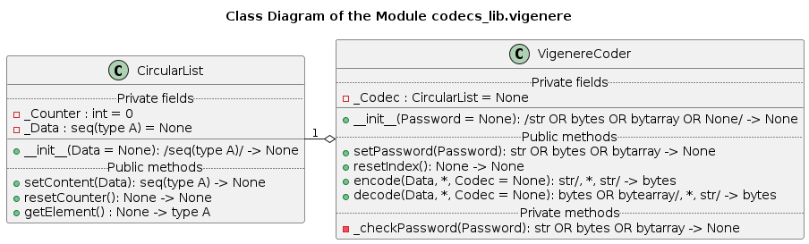

# UD002 User and API Reference Documentation on the Module codecs_lib.vigenere

## Scope

This document provides reference documentation on the module **codecs_lib.vigenere**, which implements the data scrambling (encoding / decoding) algorithm based on the extended version (modulo 256) of the Vigenere substitution cipher- see [Wikipedia](https://en.wikipedia.org/wiki/Vigen%C3%A8re_cipher). Intended functionality of the module, design and implementation details as well as API reference are provided.

Covered functional components:

* Class **CircularList**
* Class **VigenereCoder**

## Design and Functionality

The Vigenere cipher is a method of encryption based on the multiple substitution tables, which are rotated after each encoded or decoded character. In its original variant (by Bellaso, not the actual *autokey cipher* by Vigenere) the encoding / decoding key is constructed by repeating the *pass-phrase* as many times as it requires to obtain the same length as the text to be ciphered or de-ciphered. Each character in the constructed key defines the substitution table for a single character in the plaintext or ciphertext, which is a Caesar cipher, i.e. *circular* shift of the alphabet. During the ciphering the original character in the plaintext is shifted right in the alphabet by the specific number of positions defined by the corresponding character in the key; whilst during deciphering the characters are shifted left in the alphabet by the same number of positions using exactly the same key.

Orginially it was used only for 26 letters of latin alphabet, i.e. the algorithm is based on the addition and subtraction *modulo* 26. However, it is easily extensible to an arbitrary number of characters. For instance, any Unicode symbol / character can be represented (encoded) as a sequence of 1, 2 or more bytes depending on it Unicode code point and the used encoding scheme (UTF-8, UTF-16_LE, UTF-32-LE, etc.). The *pass-phrase* can be an arbitrary sequence of bytes, repeated over and over to match the lengh of the byte-encoded original Unicode text. The Vigenere encoded data will be a sequence of bytes of the same length. Thus, representing the original (byte-encoded) text as $\{O_i\}$, key as $\{K_i\}$ and the ciphered data as $\{E_i\}$ the extended Vigenere cipher algorithm is described as:

$$
E_i = (O_i + K_i) \space \mathtt{mod} \space 256
$$

and

$$
O_i = (E_i - K_i) \space \mathtt{mod} \space 256
$$

As long as the same pass-phrase and Unicode codec are applied to the ciphered data the original data is restored regardless of the Unicode symbols used.

**Note** that this cipher is cryptographically weak, and it is not to be used for the data encryption / privacy protection. However, it is good enough for preventing accidental data disclosure due to its scrambled nature.

The intended use for this 'coder' is to read data from a text file or any other input stream in the *text mode*, convert it into a sequence of bytes, apply the cipher, and write the 'ciphered' data into another file or an output stream in the *binary mode*. The deciphering process is reversed: read in binary mode, decipher, convert bytes sequence into Unicode characters (with the same codec!) and write output in the text mode.

## Implementation Details

The class diagram of the module is shown below.

The class **CircularList** implements an *indefinite looping* through a finite length sequence. Each call of the method *getElement*() returns a single, current element of the sequence and shifts the internal pointer to the next element in the sequence. As soon as the end of the sequence is reached the index is automatically reset to the start of the sequence. Such reset can be made explicitely by calling the method *resetCounter*().

An instance of this class can operate on ANY *iterable sequence* data type, including Unicode strings, bytestrings, byte arrays, generic Python lists and tuples, etc. Such sequence can be passed during the instantiation, or it can be (re-) assigned at any moment later using the method *setContent*(), which also automatically resets the internal counter.

An instance of the class **CircularList** is used within the **VigenereCoder** class to store the *pass-phrase* and to auto-generate the encrypting / decrypting key matching the length of the data. The *pass-phrase* can be defined as an arbitrary bytestring, bytes array or string (Unicode), with the later being automatically UTF-8 encoded into a bytestring. The pass-phrase can be passed during the instantiation or (re-) assigned at any moment using the method *setPassword*(). However, it MUST be defined before the first call to the *encode*() or *decode*() methods.

The method *encode*() requires a string (Unicode) mandatory argument as its input, which string is encoded into the bytestring using UTF-8 codec, unless another valid and Python registered codec is specified via the keyword-only argument *Codec* (string value). The bytestring is then per-byte Vigenere ciphered using the defined byte-wise key auto-generated from the pass-phrase. The resulting sequence of bytes is returned as a bytestring.

The method *decode*() accepts a bytestring or bytes array mandatory argument as its input. The input is per-byte Vigenere deciphered using the defined byte-wise key auto-generated from the pass-phrase starting from the current position in the key. The resulting sequence of bytes in decoded back into a sequence of Unicode symbols (string) using UTF-8 codec, unless another valid and Python registered codec is specified via the keyword-only argument *Codec* (string value).

Note, that each ciphered / deciphered byte shifts the pointer / index within the effectively indefinite but repetitive key by one position. In order to deciphere correctly the reverse process must start from the same position within the circular key as the direct process (ciphering). The method *resetIndex*() serves for the synchronization of the encrypting / decrypting keys by reseting the internal index / pointer to the beginning of the pass-phrase. Note, that the method *setPassword*() also sets the internal pointer to the start of the pass-phrase.

Due to this design it is possible to implement the following modes of operation:

* An entire file is encrypted / decrypted in one run as a single chunk
* The file's content is processed per line - using *newline characters* as delimiters / synchronization marks
* A file / stream is processed in 'packages' - blocks of the fixed length

## API

### Classes

#### Class CircularList

Implementation of an indefinite, repetitive feeder based on a circular list, where one element at a time is returned with each call to the method *getElement*(), and all elements of the stored sequence are iterated in an indefinite looping with wrapping from the end to the beginning of the sequence.

***Instantitation***

**\_\_init\_\_**(*Data* = None)

*Signature*:

/seq(type A)/ -> None

*Args*:

* *Data*: (optional) **seq(type A)**; any sequence of any elements, the content to be stored, defaults to *None*, in which case the container is initially emtpy, and its content must be set explicitely before use

*Raises*:

* **UT_TypeError**: the argument is not a sequence type
* **UT_ValueError**: the argument is an empty sequence

*Description*:

Initializer. Sets the internal counter to zero. Optionally sets the content of the container, if a proper sequence type is passed.

***Methods***

**setContent**(*Data*)

*Signature*:

seq(type A) -> None

*Args*:

* *Data*: **seq(type A)**; any sequence of any elements, the content to be stored

*Raises*:

* **UT_TypeError**: the argument is not a sequence type
* **UT_ValueError**: the argument is an empty sequence

*Description*:

Copies and stores the passed sequence content into the internal buffer to be used as the data feed source.

**resetConter**()

*Signature*:

None -> None

*Description*:

Resets the internal counter (pointer to an element) to zero.

**getElement**()

*Signature*:

None -> type A

*Raises*:

* **UT_Exception**: the stored content is not yet set

*Description*:

Returns the current element of the stored content and increments the internal counter. Upon reaching the last element of the stored content the internal counter is automatically reset to zero.

#### Class VigenereCoder

Implementation of a codec based on the extended (mod 256) Vigenere substituion algorithm using cyclic pass-phrase. The pass-phrase can be set during instantiation or later using the dedicated method as a bytestring, bytes array or a string (Unicode), in the last case the string is automatically converted into a bytestring using UTF-8 codec. The pass-phrase must be set before the first encoding or decoding attempt.

The internal index for the cyclic pass-phrase is never implicitely reset. Use the dedicated method explicitely or (re-) set the pass-phrase to reset the internal index. With this approach the codec is appropriate for the continuous data feed, e.g. for an input stream.

***Instantiation***

**\_\_init\_\_**(*Password* = None)

*Signature*:

/str OR bytes OR bytearray OR None/-> None

*Args*:

* *Password*: (optional) **str** OR **bytes** OR **bytearray** OR **None**; pass-phrase to be used, unless *None* value (default) is passed, in which case the pass-phrase is not set.

*Raises*:

* **UT_TypeError**: the passed argument is neither string, nor bytes array, nor bytestring, nor None

*Description*:

Initializer. If the optional *Password* argument is passed (and not None) the pass-phrase is also set. The passed string is converted into a bytestring using UTF-8 codec.

***Methods***

**setPassword**(*Password*)

*Signature*:

str OR bytes OR bytearray -> None

*Args*:

* *Password*: **str** OR **bytes** OR **bytearray**; pass-phrase to be used

*Raises*:

* **UT_TypeError**: the passed argument is neither string, nor bytes array, nor bytestring

*Description*:

Method to set the pass-phrase to be used in encoding and decoding. The passed string is converted into a bytestring using UTF-8 codec.

**resetIndex**()

*Signature*:

None -> None

*Description*:

Method to reset the internal index to the beginning of the pass-phrase.

**encode**(*Data*, \*, *Codec*= None):

*Signature*:

str /, *, str OR None/ -> bytes

*Args*:

* *Data*: **str**; data to be encoded
* *Codec*: (keyword) **str** OR **None**; name of the Unicode codec to use for the **str** -> **bytes** conversion, if *None* or not indicated - the default UTF-8 is used

*Returns*:

**bytes**: the Vignere encoded data

*Raises*:

* **UT_TypeError**: passed mandatory argument is not a string, OR the passed keyword argument is not a string or None
* **UT_ValueError**: the requested Unicode codec is not registered or incompatible with the received Unicode string
* **UT_Exception**: the pass-phrase is not set yet

*Description*:

Encodes the data passed as a string (Unicode) using the already set pass-phrase and the specified Unicode codec (if not provided UTF-8 is used by default).

**decode**(*Data*, \*, *Codec*= None):

*Signature*:

bytes OR bytearray /, *, str OR None/ -> str

*Args*:

* *Data*: **bytes** OR **bytearray**; data to be decoded
* *Codec*: (keyword) **str** OR **None**; name of the Unicode codec to use for the **bytes** -> **str** conversion, if *None* or not indicated - the default UTF-8 is used

*Returns*:

**str**: the Vignere decoded data

*Raises*:

* **UT_TypeError**: passed mandatory argument is not a bytestring or bytes array, OR the passed keyword argument is not a string or None
* **UT_ValueError**: the requested Unicode codec is not registered or incompatible with the Vigenere decoded bytestring
* **UT_Exception**: the pass-phrase is not set yet

*Description*:

Decodes the data passed as a bytestring or bytes array using the already set pass-phrase and the specified Unicode codec (if not provided UTF-8 is used by default).
