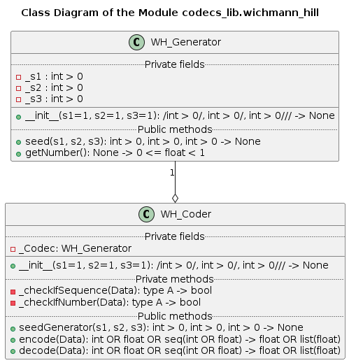

# UD003 User and API Reference Documentation on the Module codecs_lib.wichmann_hill

## Scope

This document provides reference documentation on the module **codecs_lib.wichmann_hill**, which implements the data scrambling (encoding / decoding) algorithm based on the pseudo-random numbers generator using a modified version of the Wichmann-Hill algorithm - see [Wikipedia](https://en.wikipedia.org/wiki/Wichmann%E2%80%93Hill). Intended functionality of the module, design and implementation details as well as API reference are provided.

Covered functional components:

* Class **WH_Generator**
* Class **WH_Coder**

## Design and Functionality

The aim of this module is to provide processing functionality concerning the data generated by some *specific legacy software*. It is designed for 'encryption' and 'decryption' of sequences of real numbers, typically, using floating point data type.

The data 'encryption' is defined as:

$$
OutData = \frac{InData}{PRN + {10}^{-6}}
$$

where *PRN* is a *pseudo-random* number generated separately (anew) for each number in the input data sequence using some determinstic random numbers generator (RNG) seeded with specific value(s) serving as an encryption / decryption key.

The 'encrypted' sequence is deciphered back as

$$
OutData = InData \times (PRN + {10}^{-6})
$$

where the generator is re-seeded with the same key prior to the decryption.

Mathematically speaking, the encryption algorithm is completely reversible, i.e. the decrypted data is identical to the intial (before encryption), as long as the both sequences of the generated pseudo-random numbers are identical - which is guaranteed by using the deterministic RNG seeded with the same value(s) - and do not include '-1E-6' value. In practice, however, some loss of precision may occur due to the finite representation of the fractional numbers, especially when the *single precision* data type is used. In Python all floating point fractional numbers are stored using *double precision*, therefore this effect is negligable.

The RNG used in this module is a specific variant of the Wichmann-Hill algorithm designed for 16-bit signed integer arithmetics machines. It is based on 3 linear generators, which are seeded initially with 3 arbitrary positive numbers. Due to the Python's support for an arbitrary length integers the original limitation on the seed values being less that 2^15 - 1 is not applicable, and they may be of any magnitude, even exceding the *processor word* bit-length representable values.

In order to calculate a pseudo-random number the value of each of the internal generators is updated from its current state as

$$
s_1 = \left( 171 \times (s_1 \space \mathtt{mod} \space 177) - 2 \times  \left \lfloor \frac{s_1}{177} \right \rfloor \right) \space \mathtt{mod} \space 30269 \\
\space \\
s_2 = \left( 172 \times (s_2 \space \mathtt{mod} \space 176) - 35 \times  \left \lfloor \frac{s_2}{176} \right \rfloor \right) \space \mathtt{mod} \space 30307 \\
\space \\
s_3 = \left( 170 \times (s_3 \space \mathtt{mod} \space 178) - 63 \times  \left \lfloor \frac{s_3}{178} \right \rfloor \right) \space \mathtt{mod} \space 30323
$$

where $x \space \mathtt{mod} \space y$ means the *integer remainder* of the division of *x* by *y*, and $\lfloor x \rfloor$ is the *floor rounding* of *x*, i.e. downward to the closest integer number less than or equal to *x*. Then a pseudo-random number is calculated from the updated values of three generators.

$$
r = \left( \frac{s_1}{30269} + \frac{s_2}{30307} + \frac{s_3}{30323} \right) - \left \lfloor \frac{s_1}{30269} + \frac{s_2}{30307} + \frac{s_3}{30323} \right \rfloor
$$

In this particular variant the values of the internal generators are always positive and limited below 30268, 30306 and 30322 respectively, except for the seed values, which can be of any non-zero integer values, even negative. Mathematically, the generated pseudo-random number are uniformly dsitributed within the double-open interval (0, 1), although, in practice, zero values is possible but highly unlikely due to the rounding-up errors / finite precision of the floating point data type arithmetics.

## Implementation Details

The class diagram of the module is shown below.

The class **WH_Generator** provides implementation of the Wichmann-Hill RNG according to the formulas above. It is written for two reasons:

* WH RNG is no longer a part of the Python Standard Library (used to be included in Python 2.x series, but not in Python 3.6+)
* There are different variants of the algorithm, including some faulty implementations - therefore, in order to ensure the compatibility with the legacy code, a specific variant is required.

This class can be instantiated with one, two or three positive integers, wich are used as the seed value, whereas the default value of 1 is used for the seed values not passed as the arguments of the call. The interal states can be re-seeded at any time using the method *seed*() with exactly 3 positive integer arguments passed. A pseudo-random is calculated and returned upon call to the method *getNumber*(), which, at first, updates the state of the internal linear generators, and then calculates the new pseudo-random random value.

The class **WH_Coder** uses an instance of the **WH_Generator** class to supply the pseudo-random numbers used for the 'encryption' / 'decryption' of the data. It can be instantiated with one, two or three positive integers, wich are used as the seed value for the internal WH RNG, whereas the default value of 1 is used for the seed values not passed as the arguments of the call. The interal states of the WH RNG can be re-seeded at any time using the method *seedGenerator*() with exactly 3 positive integer arguments passed.

The both *encode*() and *decode*() methods of this class are designed to accept either a single real number (**int** or **float**) or any sequence of such numbers. They return a single floating point (**float**) number or a sequence of the floating point numbers of the same length as the input.

## API

### Classes

#### Class WH_Generator

Implementation of a pseudo-random number generator in the range [0, 1) based on the modified Wichmann-Hill algorithm with strictly positive integer seeds at any time.

***Instantitation***

**\_\_init\_\_**(*s1* = 1, *s2* = 1, *s3* = 1)

*Signature*:

/int > 0/, int > 0/, int > 0/// -> None

*Args*:

* *s1*: (optional) **int** > 0; the first number to be used as a seed, defaults to 1
* *s2*: (optional) **int** > 0; the second number to be used as a seed, defaults to 1
* *s3*: (optional) **int** > 0; the third number to be used as a seed, defaults to 1

*Raises*:

* **UT_TypeError**: any of the passed arguments is not an integer
* **UT_ValueError**: any of the passed arguments is a negative integer or zero

*Description*:

Initializer. Up to 3 positive integers can be supplied to be used as the seed values. By default the value 1 is used for each not supplied seed value.

***Methods***

**seed**(*s1*, *s2*, *s3*)

*Signature*:

int > 0, int > 0, int > 0 -> None

*Args*:

* *s1*: **int** > 0; the first number to be used as a seed, defaults to 1
* *s2*: **int** > 0; the second number to be used as a seed, defaults to 1
* *s3*: **int** > 0; the third number to be used as a seed, defaults to 1

*Raises*:

* **UT_TypeError**: any of the passed arguments is not an integer
* **UT_ValueError**: any of the passed arguments is a negative integer or zero

*Description*:

Method to change all 3 current seed values.

**getNumber**()

*Signature*:

None -> 0 <= float < 1

*Description*:

Updates the current seed values following the modified Wichmann-Hill algorithm, then calculates and returns a pseudo-random floating point number in the range [0, 1).

#### Class WH_Coder

Implementation of a coder / data scrambler based on the pseudo-random number generator in the range [0, 1) using the modified Wichmann-Hill algorithm - see **WH_Generator** class.

***Instantitation***

**\_\_init\_\_**(*s1* = 1, *s2* = 1, *s3* = 1)

*Signature*:

/int > 0/, int > 0/, int > 0/// -> None

*Args*:

* *s1*: (optional) **int** > 0; the first number to be used as a seed, defaults to 1
* *s2*: (optional) **int** > 0; the second number to be used as a seed, defaults to 1
* *s3*: (optional) **int** > 0; the third number to be used as a seed, defaults to 1

*Raises*:

* **UT_TypeError**: any of the passed arguments is not an integer
* **UT_ValueError**: any of the passed arguments is a negative integer or zero

*Description*:

Initializer. Up to 3 positive integers can be supplied to be used as the seed values in the internal WH generator. By default the value 1 is used for each not supplied seed value.

***Methods***

**seedGenerator**(*s1*, *s2*, *s3*)

*Signature*:

int > 0, int > 0, int > 0 -> None

*Args*:

* *s1*: **int** > 0; the first number to be used as a seed, defaults to 1
* *s2*: **int** > 0; the second number to be used as a seed, defaults to 1
* *s3*: **int** > 0; the third number to be used as a seed, defaults to 1

*Raises*:

* **UT_TypeError**: any of the passed arguments is not an integer
* **UT_ValueError**: any of the passed arguments is a negative integer or zero

*Description*:

Method to change all 3 current seed values within the internal pseudo-random numbers generator.

**encode**(*Data*)

*Signature*:

int OR float OR seq(int OR float) -> float OR list(float)

*Args*:

* *Data*: **int** OR **float** OR **seq**(**int** OR **float**); a real number or any sequence of real numbers to be encoded

*Returns*:

* **float**; the encoded number - for a single number input
* **list**(**float**): the encoded numbers - for the sequence input

*Raises*:

* **UT_TypeError**: the input is neither int, nor float, nor sequence of int or float

*Description*:

Method to encode a single real number or a sequence of such numbers.

**decode**(*Data*)

*Signature*:

int OR float OR seq(int OR float) -> float OR list(float)

*Args*:

* *Data*: **int** OR **float** OR **seq**(**int** OR **float**); a real number or any sequence of real numbers to be decoded

*Returns*:

* **float**; the decoded number - for a single number input
* **list**(**float**): the decoded numbers - for the sequence input

*Raises*:

* **UT_TypeError**: the input is neither int, nor float, nor sequence of int or float

*Description*:

Method to decode a single real number or a sequence of such numbers.
