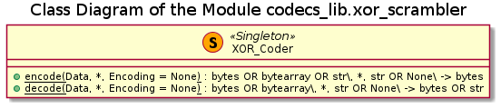

# UD004 User and API Reference Documentation on the Module codecs_lib.xor_scrambler

## Scope

This document provides reference documentation on the module **codecs_lib.xor_scrambler**, which implements the simple per-byte XOR scrambling of the data. Intended functionality of the module, design and implementation details as well as API reference are provided.

Covered functional components:

* Class **XOR_Coder**

## Design and Functionality

The purpose of this module is to provide a simple dataloss-less scrambling algorith for the basic data security. Such data modification does not need to be a true cryptographic encription, but it should prevent accidental disclosure or modification of a sensitive data. For example, some login credentials stored only localy on a workstation and not shared even wihtin the local network. Basically, if an attacker gets an access to such a file, the entire local network is most probably already compromised. On the other hand, it is just unethical to store passwords in a plain text in a corporate, multiple users environment.

Thus a simple solution - instead of storing such configuration / credentials file as a plain text, including JSON, the data should be stored in a binary form with a reversible, dataloss-less modification being applied. In essence, a textual data is encoded into a byte representation, e.g. using UTF8 or specific byte-order UTF-16-LE or UTF-32-LE codecs, when each of the bytes is modified and the resulting byte-string is saved into a file in a binary mode. This approach is sufficient to prevent the file from being opened in any of the generic, not HEX-oriented text editors, simply because the encoding is corrupted. However, by appling the reverse per-byte modification and consecutive decoding with the same Unicode codec the original text is restored.

The XOR scrambling is chosen due to its simplicity. Basically, bit-wise XOR operation of any **byte** value with 255d (0xFF, 1111111b) reverses / flips its individual bit (0 -> 1 and 1 -> 0). However, by appling XORing with 255 again the original **byte** value is restored. Thus this operation is its own reverse.

The encoding part is designed to accept an arbitrary length sequence of bytes (as **bytes** - byte-string, or **bytearray** type) or string (Unicode by default in Python3) and return a byte-string (**bytes**) with the data already scrambled. If the input is provided in the form of an usual string, the UTF-8 encoding is applied, unless a different codec is requested explicitely.

The decoding part is designed to accept an arbitrary length byte-string or bytes array, unscramble it and return as a byte-string. However, if a proper (registred with Python and compatible witht he byte-representation) Unicode codec is specified, the generated byte-string is decoded back to a normal (Unicode) string.

## Implementation Details

The module implements a single class **COBS_Coder**, which has only two methods - **encode()** and **decode()**, both of which are class methods. Thus the class can be used without instantiation as a *Singleton*, see figure below.

The activity diagrams of the methods are shown below.

## API

### Classes

#### Class XOR_Coder

Singleton-like class implementing per-byte XOR based scrambling and unscrambling. All methods are class methods, thus the instantiation is not required, although it is possible.

***Class Methods***

**encode**(*Data*, \*, *Encoding* = None)

*Signature*:

bytes OR bytearray OR str\\, *, str OR None\ -> bytes

*Args*:

* *Data*: **bytes** OR **bytearray** OR **str**; data to be encoded
* *Encoding*: (keyword only) **str** OR **None**; name of the Unicode codec to be used, None defaults to *UTF8*

*Returns*:

**bytes**: encoded byte-string

*Raises*:

* **UT_TypeError**: *Data* is neither bytes nor bytearray nor string, OR *Encoding* is neither a string nor None when *Data* is a string
* **UT_ValueError**: *Encoding* is not a registered, OR registered but improper codec - only if *Data* is a string

*Description*:

Encodes the input into a byte string using per byte XOR with 255 (0xFF). If the input is a string and *Encoding* is not specified or None the UTF8 is assumed, otherwise the specified codec is used, which must be registred with Python.

**decode**(*Data*)

*Signature*:

bytes OR bytearray\\, *, str OR None\ -> bytes

*Args*:

* *Data*: **bytes** OR **bytearray**; data to be decoded
* *Encoding*: (keyword only) **str** OR **None**; name of the Unicode codec to be used, default value None prevents bytes -> str conversion

*Returns*:

* **bytes**: decoded byte string, *Encoding* is not specified or None
* **str**: decoded byte string additionaly decoded into a Unicode, only if a valid string *Encoding* value is provided

*Raises*:

* **UT_TypeError**: *Data* is neither bytes nor bytearray nor string, OR *Encoding* is neither a string nor None
* **UT_ValueError**: *Encoding* is not a registered, OR registered but improper codec

*Description*:

Decodes the input into a byte string using per byte XOR with 255 (0xFF). If the *Encoding* is specified and not None it is used to decode the result into a string; the codec must be registred with Python.
